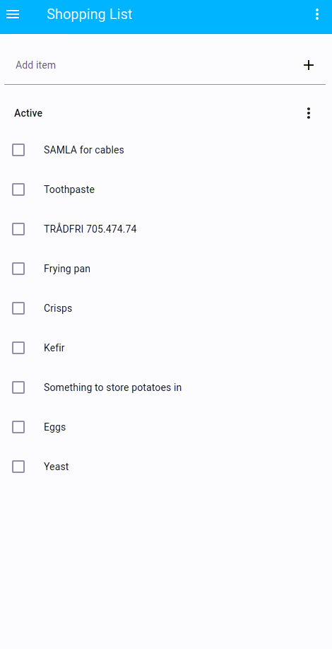

# ✏️📋🛒 Shopping List Sort

Sort your Home Assistant shopping list by store and aisle using OpenAIs GPT models just by adding `!sort` to the list!

> [!TIP]
> Quickstart:
> - Make sure you have the [OpenAI Python API library](https://pypi.org/project/openai/) installed.
> - Rename `config_example.json` to `config.json`.
> - Add your Home Assistant URL and API key and your OpenAI API key.
> - Run `python ShoppingListSort.py`.
> - Try adding `!sort` to your Shopping List.
>
> You can configure the stores and aisles in `config.json` to fit your usecase.

> [!NOTE]
> This application is in active development.
> While I tested it and it works perfectly for me, proper error handling in all places has not been implemented yet.
> **Make sure to open an issue or a pull request if you have any suggestions!**



## Motivation

While the Shopping List integration in Home Assistant is very convenient when sharing a shopping list and communicating efficiently which groceries or supplies have to be bought, it lacks any ordering.
Creating multiple shopping list is cumbersome, and walking through the aisles forth and back to find the items takes time.

Thanks to recent hype in Large Language Models (commonly called AI, although I dislike this term...) we can let the sorting be performed by a language model and still have the freedom of free text input for our shopping lists!

You have to define a list of stores and aisles. See the [Configuration Section](#configuration) for help.

## Usage

As this application currently is not a Home Assistant integration, but merely uses its REST API, you have to call it manually from any device which is able to access your Home Assistant server.

By default, ShoppingListSort listens for new items.
You can add `!sort` to your shopping list, which triggers the resorting.
Every item starting with `+`, `-`, `=` and `!` is ignored and dropped, as these are consider as formatting.

To start listening, set up the [configuration](#configuration) and call `python ShoppingListSort.py`.


## Configuration

If you rather read examples instead of explanation, take a look at `config_example.json`.

You have to configure the [API access](#api) and the [Stores](#stores) you are usually doing your shopping.
After editing save it as `config.json`.


### API and models

You have to provide this application with your Home Assistant instance and an API key.
Additionally, you have to provide it with a valid OpenAI API key and the model you want to use.
As for the models, `gpt-4.1-nano` regularly drops items and is unusable, while `gpt-4.1-mini` seems to work consistently well.
Should you ever encounter issues, you can try `gpt-4.1`, which never had any issues, even with less descriptive system prompts.

Note, that you should pick a model which supports [Structured Outputs](https://openai.com/index/introducing-structured-outputs-in-the-api/) as this application relies on them to ensure an accurate response.


### Stores and Aisles

This application groups items by store and aisle.
The idea is, that you visit the store and typically walk around a typical path.
**ShoppingListSort** aims to sort all items in such way, that you are not required to make any detours, as every item should be placed in your path.

For this, you need to provide the aisles and their order to this application.
The LLM is only used to assign every a item a store and an aisle, while the sorting is done according to the provided configuration.

Here is a shortened version of the `stores` section in `config_example.json` for reference:

```json
"stores": [
    {
        "name": "Supermarket",
        "description": "A generic supermarket.",
        "aisles": [
            {
                "name": "Fruits and Vegetables",
                "description": "Contains fruits and vegetables. Additionally has a fridge for vegan products"
            },
            {
                "name": "Eggs and Dairy",
                "description": "Contains eggs and dairy products. Additionally includes doughs"
            },
            {
                "name": "Freezer",
                "description": "Contains frozen food items."
            }
        ]
    },
    {
        "name": "Swedish furniture store",
        "description": "A well-known swedish furniture store, selling furniture and home accessories.",
        "aisles": [
            {
                "name": "Kitchen accessories",
                "description": "Contains various kitchen utensils and appliances."
            },
            {
                "name": "Storage and organization",
                "description": "Contains various storage solutions and organizational systems."
            },
            {
                "name": "Electronics",
                "description": "Lighting, batteries and more."
            },
            {
                "name": "Furniture",
                "description": "Contains various pieces of furniture."
            }
        ]
    },
]
```

## TODOs

- [ ] rewrite as Home Assistant Integration and add to HACS
- [ ] Support for Ollama and more LLM providers
- [ ] Error handling
- [ ] Command line arguments
